<div align="center">

# Handoff

**Durable multi-agent workflows with a human in the loop.**

A supervisor and four specialist agents run vendor due diligence on LangGraph. Runs survive `kill -9`, wait for a human for as long as it takes, and can be forked from any checkpoint. Trajectory evals score *how* the agents worked, not only what they concluded.

<p>
  
  
  
  
  
  
  <br />
  
  
  
  
  
  <a href=".github/workflows/ci.yml"></a>
  <a href="LICENSE"></a>
</p>

<p>
  <a href="#quickstart">Quickstart</a> ·
  <a href="#architecture">Architecture</a> ·
  <a href="#screenshots">Screenshots</a> ·
  <a href="#engineering-decisions-and-trade-offs">Design decisions</a> ·
  <a href="#api-overview">API</a>
</p>

<picture>
  <source media="(prefers-color-scheme: dark)" srcset="docs/screenshots/hero-dark.png" />
  <source media="(prefers-color-scheme: light)" srcset="docs/screenshots/hero-light.png" />
  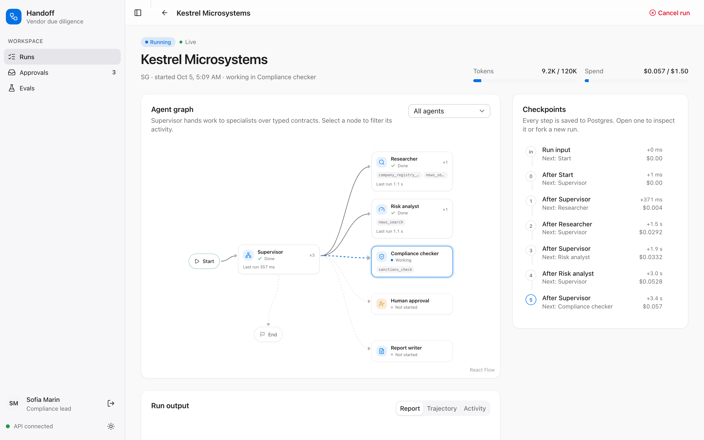
</picture>

<sub>
  A live run in the inspector. The compliance checker is working, the researcher and risk analyst are done, and every step so far is a Postgres checkpoint you can open, inspect and fork.
</sub>

</div>

---

## Why this exists

Most agent demos are a single process holding everything in memory. They fall apart at the points production cares about:

- **A worker dies mid-run.** The tokens are spent, the work is lost, and nobody can say what state the run was in.
- **A decision needs a human.** Blocking a process for hours is not an option, and auto-approving is not acceptable either.
- **Something went wrong three steps ago.** You want to rewind to that point, change one input and replay. You don't want to start over.
- **"The answer looks right"** is not an evaluation. An agent that reaches the right verdict by calling the same tool four times, or by skipping a sanctions check, is a problem.
- **Spend is unbounded.** A retry loop on a flagship model can burn a budget in minutes.

Handoff is a working reference for each of these, built around a domain where they matter: **vendor due diligence**. Should we onboard this supplier, given its registry record, its owners, adverse media and sanctions exposure? Everything runs offline against synthetic fixtures with a scripted model. Set one env var and it uses Claude instead.

## Highlights

| | |
|---|---|
| **Supervisor / specialist topology** | A LangGraph `StateGraph` with typed Pydantic state. The supervisor routes to a **researcher**, **risk analyst**, **compliance checker** and **report writer** through `Handoff` contracts. Each target declares an input model, and a handoff the state can't satisfy is rejected as a `PolicyViolation`. |
| **Durable execution** | The LangGraph Postgres checkpointer saves state after every node. Workers claim runs with `FOR UPDATE SKIP LOCKED`, renew a heartbeat lease, and fence every write with a claim counter. `SIGKILL` a worker and another one resumes the run from its last checkpoint. `make demo-crash` proves it. |
| **Human approval gates** | The approval node calls `interrupt()` with a typed `ApprovalRequest`. Reviewers approve, reject or **edit before approving** from the UI. Unanswered approvals escalate analyst → compliance lead → CRO on timeout, then auto-reject. Only the top tier can approve over a confirmed sanctions match, and only with a written justification. |
| **Cost governance** | Per-run token and dollar caps are enforced against a spend ledger that also counts failed, retried and crashed attempts. Per-node retry budgets apply only to retryable errors. Failures fall into a structured taxonomy: `ToolError`, `ModelError`, `PolicyViolation`, `BudgetExceeded`. |
| **MCP tools** | A bundled MCP server exposes `company_registry_lookup`, `sanctions_check` and `news_search` over fixtures, via stdio, Streamable HTTP or in-process. Agents depend on a `ToolGateway` protocol, so you can swap tools without touching agent code. The client reconnects on transport failure. |
| **Time travel** | Every checkpoint is browsable in a timeline. Open one to inspect its state, patch vendor, budget, research, risk or compliance, and fork a new run that continues from that step. |
| **Trajectory evals** | Nine scenarios score tool-sequence similarity (LCS per agent), handoff order, step efficiency, outcome correctness and an LLM-judged reasoning score. Run them from the CLI with a summary table and a `--min-score` gate for CI. Reports also appear in the UI. |
| **OpenTelemetry GenAI spans** | `invoke_workflow`, `invoke_agent {agent}`, `chat {model}` and `execute_tool {tool}` spans follow the GenAI semantic conventions and export over OTLP/HTTP. Re-executions after a crash or an approval pause link back to the first trace. |
| **Run inspector** | Next.js + shadcn/ui + React Flow. Live node status arrives over SSE, fed by Postgres `LISTEN/NOTIFY`. The inspector also has a checkpoint timeline, approval inbox, trajectory view, activity feed and the final report. Light and dark mode follow Apple's HIG. |
| **Offline by default** | A deterministic scripted model reads the same briefings the real model gets, and it prices its tokens like the default model so budgets still apply. The demo, the tests and the evals all run without an API key. |

## Screenshots

**Runs.** Status, outcome, risk and spend for every durable thread, updated live.

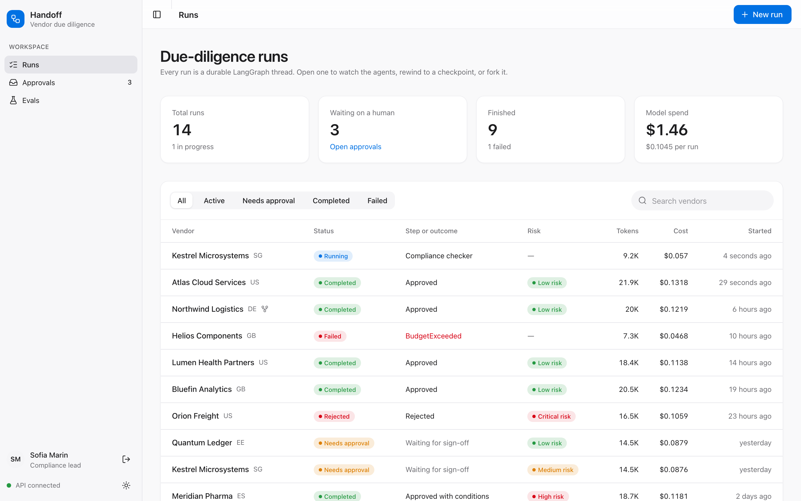

**Paused at `interrupt()`.** The run sits at a checkpoint and costs nothing while it waits for a reviewer.

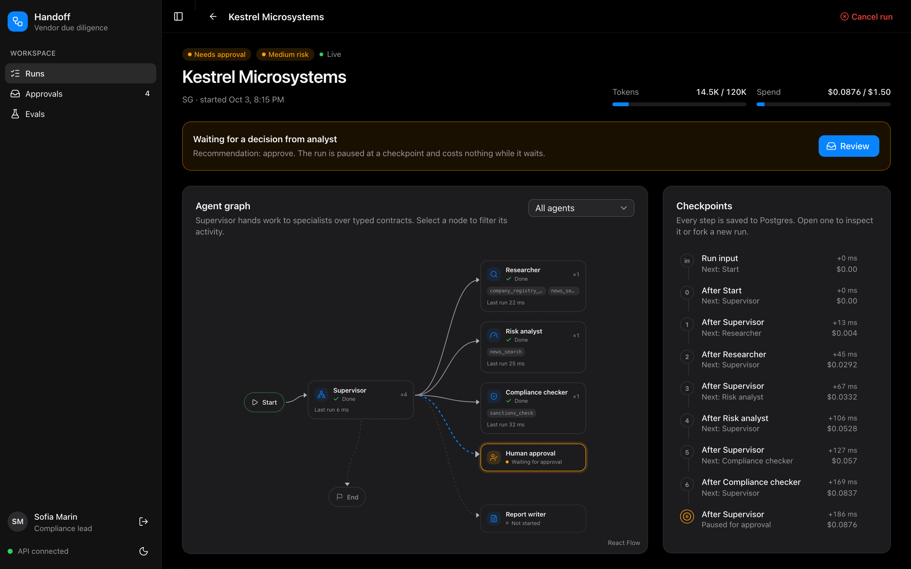

**Approval inbox.** Each request shows its recommendation, evidence-derived conditions, assignee tier and deadline.

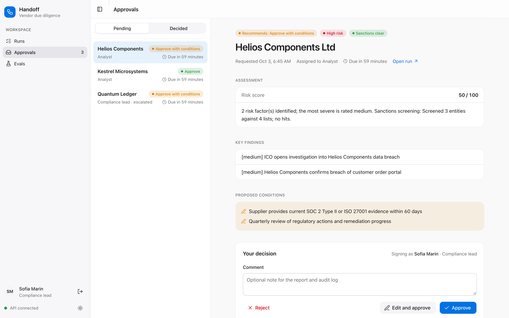

**Edit before approving.** The reviewer's rating, conditions and summary replace the agents' proposal in the final report.

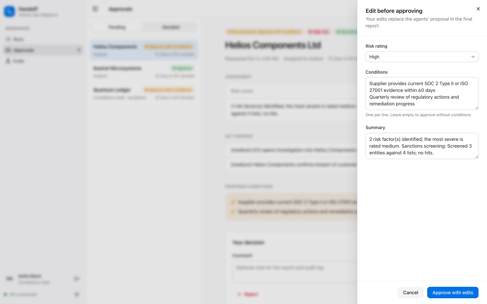

**Time travel.** Inspect state after any step, patch it, and fork a new run from there.

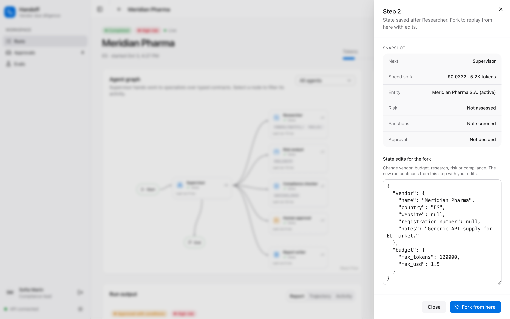

**Crash recovery.** This run's worker was SIGKILLed mid-compliance-check, and another worker picked it up from the checkpoint.

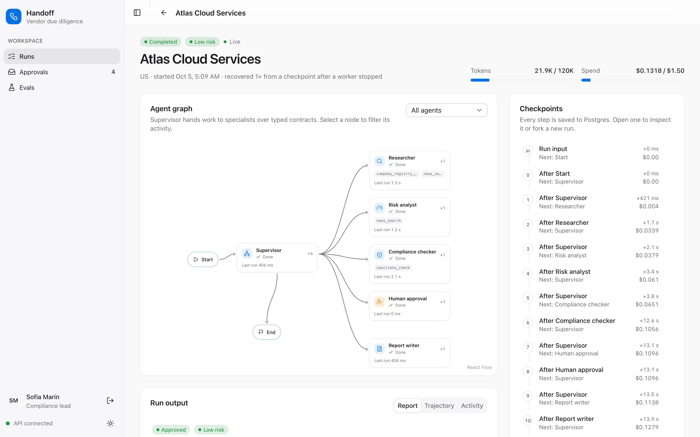

**Error taxonomy.** A $0.04 spend cap trips `BudgetExceeded` inside the risk analyst, and the failure is pinned to its node.

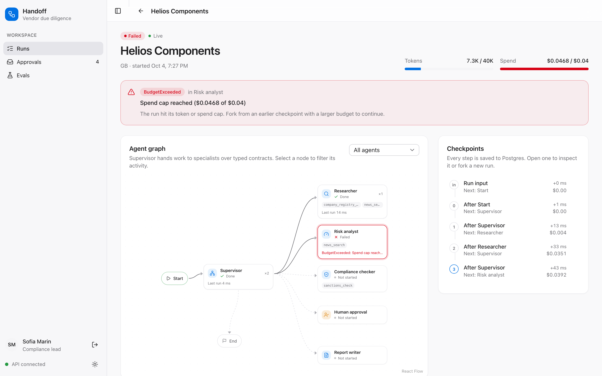

**Trajectory.** Every handoff, tool call (with arguments) and submission, in order.

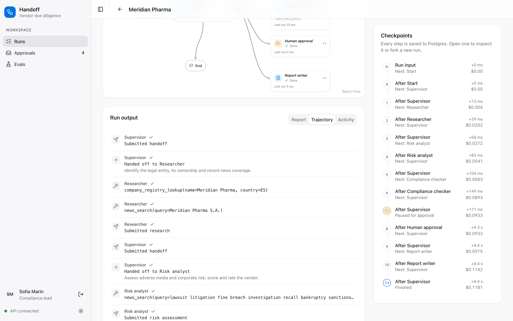

**Report.** The report writer's memo has to agree with the human decision, or it is refused.

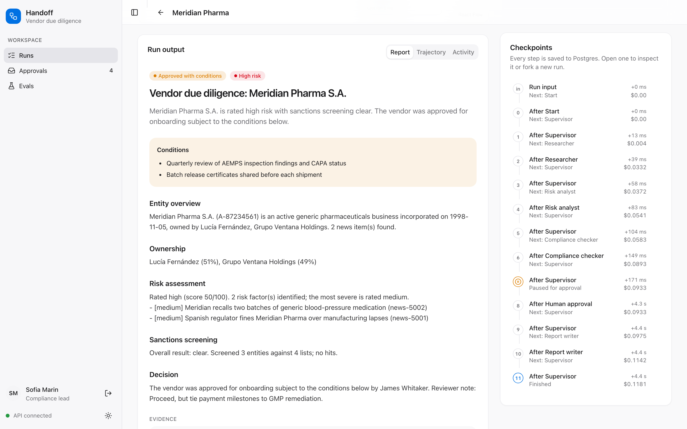

**Trajectory evals.** A redundant `news_search` call costs 14% efficiency even though the verdict is right.

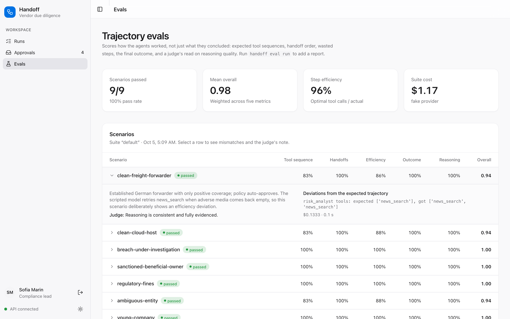

## Architecture

Three backend processes and a web app share one PostgreSQL database. Postgres stores the LangGraph checkpoints, the `runs` queue, approvals, the run event log and eval reports. It also carries the notifications that wake workers and stream events to the UI.

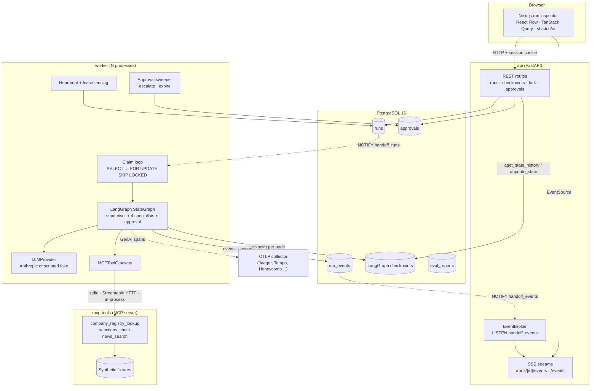
```mermaid
flowchart TB
    subgraph Browser
        UI["Next.js run inspector<br/>React Flow · TanStack Query · shadcn/ui"]
    end

    subgraph API["api (FastAPI)"]
        Routes["REST routes<br/>runs · checkpoints · fork · approvals"]
        SSE["SSE streams<br/>/runs/{id}/events · /events"]
        Broker["EventBroker<br/>LISTEN handoff_events"]
    end

    subgraph Worker["worker (N processes)"]
        Claim["Claim loop<br/>SELECT … FOR UPDATE SKIP LOCKED"]
        HB["Heartbeat + lease fencing"]
        Sweep["Approval sweeper<br/>escalate · expire"]
        Graph["LangGraph StateGraph<br/>supervisor + 4 specialists + approval"]
        LLM["LLMProvider<br/>Anthropic or scripted fake"]
        GW["MCPToolGateway"]
    end

    subgraph MCP["mcp-tools (MCP server)"]
        Tools["company_registry_lookup<br/>sanctions_check<br/>news_search"]
        Fixtures[("Synthetic fixtures")]
    end

    subgraph PG["PostgreSQL 16"]
        Runs[("runs")]
        Approvals[("approvals")]
        Events[("run_events")]
        Checkpoints[("LangGraph checkpoints")]
        Evals[("eval_reports")]
    end

    OTel["OTLP collector<br/>(Jaeger, Tempo, Honeycomb…)"]

    UI -- "HTTP + session cookie" --> Routes
    UI -- "EventSource" --> SSE
    Routes --> Runs
    Routes --> Approvals
    Routes -- "aget_state_history / aupdate_state" --> Checkpoints
    Broker --> SSE
    Events -. "NOTIFY handoff_events" .-> Broker
    Runs -. "NOTIFY handoff_runs" .-> Claim
    Claim --> Graph
    HB --> Runs
    Sweep --> Approvals
    Graph -- "checkpoint per node" --> Checkpoints
    Graph -- "events + usage" --> Events
    Graph --> LLM
    Graph --> GW
    GW -- "stdio · Streamable HTTP · in-process" --> Tools
    Tools --> Fixtures
    Graph -. "GenAI spans" .-> OTel
```

### The agent graph

The supervisor runs between every step and picks the next handoff. Every specialist returns to it. Routing is a single conditional edge driven by `state.active_handoff.target`.

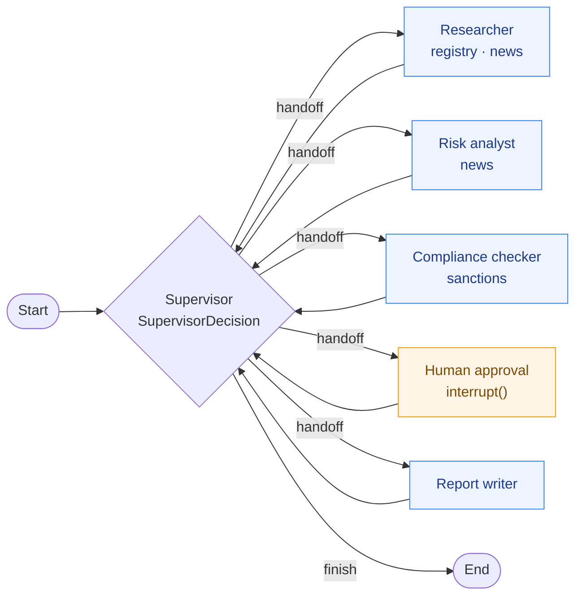
```mermaid
flowchart LR
    START(["Start"]) --> SUP{"Supervisor<br/>SupervisorDecision"}
    SUP -- "handoff" --> R["Researcher<br/>registry · news"]
    SUP -- "handoff" --> RA["Risk analyst<br/>news"]
    SUP -- "handoff" --> CC["Compliance checker<br/>sanctions"]
    SUP -- "handoff" --> AP["Human approval<br/>interrupt()"]
    SUP -- "handoff" --> RW["Report writer"]
    SUP -- "finish" --> END(["End"])
    R --> SUP
    RA --> SUP
    CC --> SUP
    AP --> SUP
    RW --> SUP

    classDef gate fill:#FFF4E5,stroke:#F59E0B,color:#7C4A03
    classDef agent fill:#EEF4FF,stroke:#3B82F6,color:#1E3A8A
    class AP gate
    class R,RA,CC,RW agent
```

Contracts are checked before a specialist sees anything:

| Target | Typed input it receives | Refused unless state has |
|---|---|---|
| `researcher` | `ResearcherInput(vendor)` | — |
| `risk_analyst` | `RiskAnalystInput(vendor, research)` | research |
| `compliance_checker` | `ComplianceInput(vendor, research)` | research |
| `approval` | `SupervisorInput` | risk assessment, compliance screening |
| `report_writer` | `ReportWriterInput(vendor, research, risk, compliance, approval)` | all of the above + approval decision |
| `finish` | — | final report |

Handing off to a step that is already complete is also a `PolicyViolation`. The supervisor gets one corrective retry with the refusal message before the node fails.

### Core flow: start, pause for a human, resume

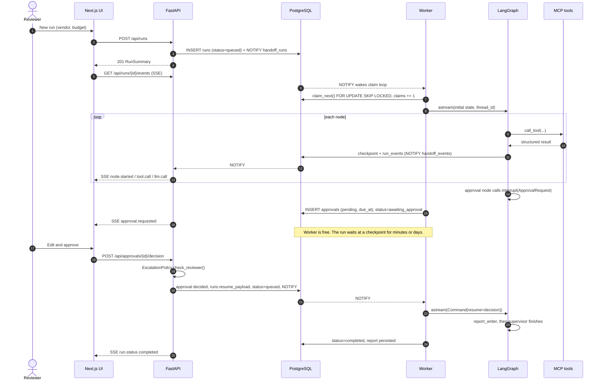
```mermaid
sequenceDiagram
    autonumber
    actor Reviewer
    participant UI as Next.js UI
    participant API as FastAPI
    participant PG as PostgreSQL
    participant W as Worker
    participant G as LangGraph
    participant MCP as MCP tools

    Reviewer->>UI: New run (vendor, budget)
    UI->>API: POST /api/runs
    API->>PG: INSERT runs (status=queued) + NOTIFY handoff_runs
    API-->>UI: 201 RunSummary
    UI->>API: GET /api/runs/{id}/events (SSE)

    PG-->>W: NOTIFY wakes claim loop
    W->>PG: claim_next() FOR UPDATE SKIP LOCKED, claims += 1
    W->>G: astream(initial state, thread_id)
    loop each node
        G->>MCP: call_tool(...)
        MCP-->>G: structured result
        G->>PG: checkpoint + run_events (NOTIFY handoff_events)
        PG-->>API: NOTIFY
        API-->>UI: SSE node.started / tool.call / llm.call
    end
    G->>G: approval node calls interrupt(ApprovalRequest)
    W->>PG: INSERT approvals (pending, due_at), status=awaiting_approval
    API-->>UI: SSE approval.requested

    Note over W,PG: Worker is free. The run waits at a checkpoint for minutes or days.

    Reviewer->>UI: Edit and approve
    UI->>API: POST /api/approvals/{id}/decision
    API->>API: EscalationPolicy.check_reviewer()
    API->>PG: approval decided, runs.resume_payload, status=queued, NOTIFY
    PG-->>W: NOTIFY
    W->>G: astream(Command(resume=decision))
    G->>G: report_writer, then supervisor finishes
    W->>PG: status=completed, report persisted
    API-->>UI: SSE run.status completed
```

### Crash recovery and lease fencing

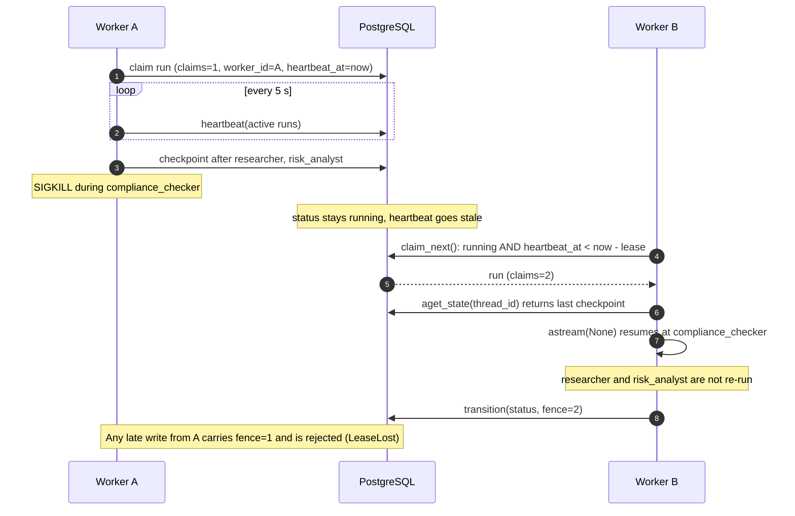
```mermaid
sequenceDiagram
    autonumber
    participant W1 as Worker A
    participant PG as PostgreSQL
    participant W2 as Worker B

    W1->>PG: claim run (claims=1, worker_id=A, heartbeat_at=now)
    loop every 5 s
        W1->>PG: heartbeat(active runs)
    end
    W1->>PG: checkpoint after researcher, risk_analyst
    Note over W1: SIGKILL during compliance_checker
    Note over PG: status stays running, heartbeat goes stale
    W2->>PG: claim_next(): running AND heartbeat_at < now - lease
    PG-->>W2: run (claims=2)
    W2->>PG: aget_state(thread_id) returns last checkpoint
    W2->>W2: astream(None) resumes at compliance_checker
    Note over W2: researcher and risk_analyst are not re-run
    W2->>PG: transition(status, fence=2)
    Note over W1,PG: Any late write from A carries fence=1 and is rejected (LeaseLost)
```

Real output from `make demo-crash`:

```text
Created run f21bdef6-d305-42bc-a2dd-834cd5a3a016 for Atlas Cloud Services
Started worker pid 47806 (logs: .data/crash-demo-worker.log)
SIGKILL worker during compliance_checker after 7 checkpoints. Run status is still running but its worker is gone.
Started a new worker pid 48246; it takes the run over once the dead worker's 6s lease goes stale
Run finished as completed with 13 checkpoints
Node executions around the crash
┏━━━━━━━━━━━━━━━━━━━━┳━━━━━━━━━━━━━━━━━━━━━━━┳━━━━━━━━━━━━━━━━━━━━━━━┓
┃ Node               ┃ Completed before kill ┃ Started after restart ┃
┡━━━━━━━━━━━━━━━━━━━━╇━━━━━━━━━━━━━━━━━━━━━━━╇━━━━━━━━━━━━━━━━━━━━━━━┩
│ supervisor         │                     3 │                     3 │
│ researcher         │                     1 │                     0 │
│ risk_analyst       │                     1 │                     0 │
│ compliance_checker │                     0 │                     1 │
│ approval           │                     0 │                     1 │
│ report_writer      │                     0 │                     1 │
└────────────────────┴───────────────────────┴───────────────────────┘
5 completed node executions were restored from Postgres checkpoints; only compliance_checker (in flight at the kill) ran again.
```

### Run lifecycle

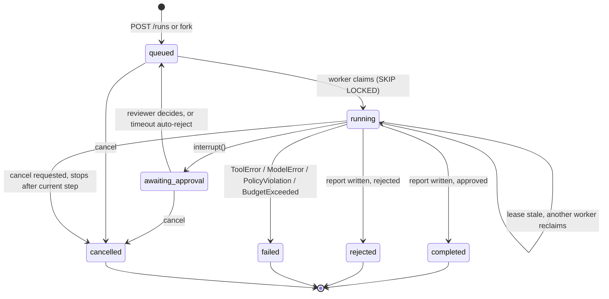
```mermaid
stateDiagram-v2
    [*] --> queued: POST /runs or fork
    queued --> running: worker claims (SKIP LOCKED)
    running --> running: lease stale, another worker reclaims
    running --> awaiting_approval: interrupt()
    awaiting_approval --> queued: reviewer decides, or timeout auto-reject
    awaiting_approval --> cancelled: cancel
    queued --> cancelled: cancel
    running --> cancelled: cancel requested, stops after current step
    running --> completed: report written, approved
    running --> rejected: report written, rejected
    running --> failed: ToolError / ModelError / PolicyViolation / BudgetExceeded
    completed --> [*]
    rejected --> [*]
    failed --> [*]
    cancelled --> [*]
```

### Reviewer flow

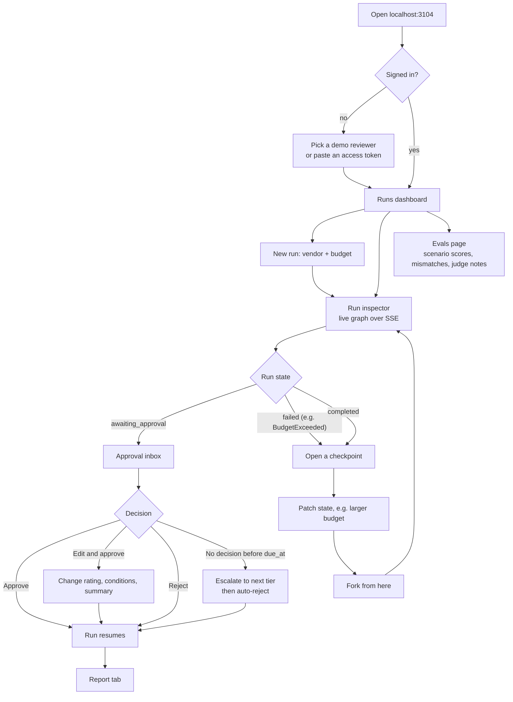
```mermaid
flowchart TD
    A["Open localhost:3104"] --> B{"Signed in?"}
    B -- "no" --> C["Pick a demo reviewer<br/>or paste an access token"]
    C --> D["Runs dashboard"]
    B -- "yes" --> D
    D --> E["New run: vendor + budget"]
    E --> F["Run inspector<br/>live graph over SSE"]
    D --> F
    F --> G{"Run state"}
    G -- "awaiting_approval" --> H["Approval inbox"]
    H --> I{"Decision"}
    I -- "Approve" --> J["Run resumes"]
    I -- "Edit and approve" --> K["Change rating, conditions, summary"] --> J
    I -- "Reject" --> J
    I -- "No decision before due_at" --> L["Escalate to next tier<br/>then auto-reject"] --> J
    J --> M["Report tab"]
    G -- "failed (e.g. BudgetExceeded)" --> N["Open a checkpoint"]
    G -- "completed" --> N
    N --> O["Patch state, e.g. larger budget"]
    O --> P["Fork from here"] --> F
    D --> Q["Evals page<br/>scenario scores, mismatches, judge notes"]
```

### Data model

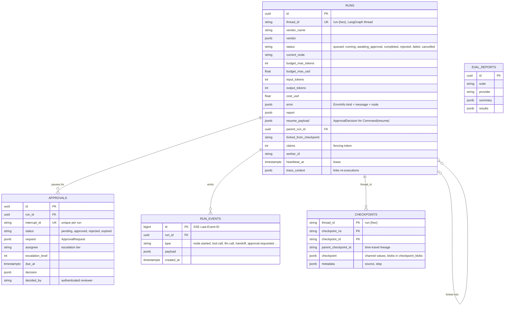
```mermaid
erDiagram
    RUNS ||--o{ APPROVALS : "pauses for"
    RUNS ||--o{ RUN_EVENTS : "emits"
    RUNS |o--o{ RUNS : "forked into"
    RUNS ||--|{ CHECKPOINTS : "thread_id"

    RUNS {
        uuid id PK
        string thread_id UK "run-{hex}, LangGraph thread"
        string vendor_name
        jsonb vendor
        string status "queued, running, awaiting_approval, completed, rejected, failed, cancelled"
        string current_node
        int budget_max_tokens
        float budget_max_usd
        int input_tokens
        int output_tokens
        float cost_usd
        jsonb error "ErrorInfo kind + message + node"
        jsonb report
        jsonb resume_payload "ApprovalDecision for Command(resume)"
        uuid parent_run_id FK
        string forked_from_checkpoint
        int claims "fencing token"
        string worker_id
        timestamptz heartbeat_at "lease"
        jsonb trace_context "links re-executions"
    }
    APPROVALS {
        uuid id PK
        uuid run_id FK
        string interrupt_id UK "unique per run"
        string status "pending, approved, rejected, expired"
        jsonb request "ApprovalRequest"
        string assignee "escalation tier"
        int escalation_level
        timestamptz due_at
        jsonb decision
        string decided_by "authenticated reviewer"
    }
    RUN_EVENTS {
        bigint id PK "SSE Last-Event-ID"
        uuid run_id FK
        string type "node.started, tool.call, llm.call, handoff, approval.requested ..."
        jsonb payload
        timestamptz created_at
    }
    EVAL_REPORTS {
        uuid id PK
        string suite
        string provider
        jsonb summary
        jsonb results
    }
    CHECKPOINTS {
        string thread_id PK "run-{hex}"
        string checkpoint_ns PK
        string checkpoint_id PK
        string parent_checkpoint_id "time-travel lineage"
        jsonb checkpoint "channel values, blobs in checkpoint_blobs"
        jsonb metadata "source, step"
    }
```

`checkpoints`, `checkpoint_blobs` and `checkpoint_writes` belong to `langgraph-checkpoint-postgres`. The deserializer only revives the project's own state models (`allowed_msgpack_modules`).

## Trajectory evals

```bash
make eval   # handoff eval run: offline, stores the report for the Evals page
```

```text
Trajectory evals: default (fake)
┏━━━━━━━━━━━━━━━━━━━━━━━━━━━━━┳━━━━━━━━┳━━━━━━━━━━┳━━━━━━━━━━┳━━━━━━━━━━━━┳━━━━━━━━━┳━━━━━━━━━━━┳━━━━━━━━━┳━━━━━━━━┓
┃ Scenario                    ┃ Result ┃ Tool seq ┃ Handoffs ┃ Efficiency ┃ Outcome ┃ Reasoning ┃ Overall ┃   Cost ┃
┡━━━━━━━━━━━━━━━━━━━━━━━━━━━━━╇━━━━━━━━╇━━━━━━━━━━╇━━━━━━━━━━╇━━━━━━━━━━━━╇━━━━━━━━━╇━━━━━━━━━━━╇━━━━━━━━━╇━━━━━━━━┩
│ clean-freight-forwarder     │ pass   │      83% │     100% │        86% │    100% │      100% │    0.94 │ $0.133 │
│ clean-cloud-host            │ pass   │      83% │     100% │        88% │    100% │      100% │    0.94 │ $0.145 │
│ breach-under-investigation  │ pass   │     100% │     100% │       100% │    100% │      100% │    1.00 │ $0.137 │
│ sanctioned-beneficial-owner │ pass   │     100% │     100% │       100% │    100% │      100% │    1.00 │ $0.131 │
│ regulatory-fines            │ pass   │     100% │     100% │       100% │    100% │      100% │    1.00 │ $0.130 │
│ ambiguous-entity            │ pass   │      83% │     100% │        88% │    100% │      100% │    0.94 │ $0.135 │
│ young-company               │ pass   │     100% │     100% │       100% │    100% │      100% │    1.00 │ $0.119 │
│ fuzzy-sanctions-hit         │ pass   │     100% │     100% │       100% │    100% │      100% │    1.00 │ $0.124 │
│ dissolved-entity            │ pass   │     100% │     100% │       100% │    100% │      100% │    1.00 │ $0.118 │
├─────────────────────────────┼────────┼──────────┼──────────┼────────────┼─────────┼───────────┼─────────┼────────┤
│ mean                        │ 9/9    │      94% │     100% │        96% │    100% │      100% │    0.98 │ $1.171 │
└─────────────────────────────┴────────┴──────────┴──────────┴────────────┴─────────┴───────────┴─────────┴────────┘
clean-freight-forwarder: risk_analyst tools: expected ['news_search'], got ['news_search', 'news_search']
```

| Metric | Weight | How it is computed |
|---|---|---|
| Tool sequence | 0.25 | Per agent, LCS(expected, actual) / max(len). Missing, extra and out-of-order calls all cost. |
| Handoff order | 0.15 | The same LCS similarity over the supervisor's handoff targets. |
| Efficiency | 0.15 | Optimal tool calls / actual tool calls, capped at 1. |
| Outcome | 0.25 | Risk rating, compliance status, final decision and whether a human was required, each checked against the scenario. |
| Reasoning | 0.20 | An LLM judge scores the evidence trail from 1 to 5 against a `Judgement` schema, normalised to 0–1. |

A scenario passes at ≥ 0.80. The three 0.94 rows are deliberate: when adverse media comes back empty, the scripted model searches again. The efficiency metric exists to catch exactly that kind of redundancy. CI runs `handoff eval run --min-score 0.9` and uploads the JSON report as an artifact.

## Tech stack

| Layer | Choice | Why |
|---|---|---|
| Orchestration | **LangGraph 1.x** `StateGraph`, `RetryPolicy`, `interrupt()`, `Command(resume=…)` | Checkpointing, interrupts and state history are first-class, so durability is not bolted on. |
| Persistence | **PostgreSQL 16**, `langgraph-checkpoint-postgres`, **SQLAlchemy 2.0 async** + **Alembic**, psycopg 3 | One database for checkpoints, the work queue, approvals and events, so there is no Redis or broker to keep consistent. |
| API | **FastAPI**, **sse-starlette**, Pydantic v2 DTOs | Typed contracts end to end, with SSE replay by `Last-Event-ID`. |
| Agents | **Anthropic SDK** (prompt caching, effort control, refusal fallback) behind an `LLMProvider` protocol, plus a scripted fake | You can swap providers, and tests are deterministic. |
| Tools | **MCP Python SDK** server + client (stdio, Streamable HTTP, in-process) | Tools are a separate, swappable process with their own schemas. |
| Config | **pydantic-settings** with cross-field validation | Invalid lease and heartbeat ratios, unknown reviewer roles and demo tokens in production fail at startup. |
| Observability | **OpenTelemetry SDK** + OTLP/HTTP exporter, **structlog** | GenAI semantic-convention spans plus structured logs carrying `run_id` and `worker_id`. |
| CLI | **Typer** + **Rich** | `api`, `worker`, `mcp-tools`, `db init`, `seed`, `eval run`, `demo crash`. |
| Frontend | **Next.js 16** App Router (React 19.2), **TypeScript strict**, **shadcn/ui**, **React Flow** (`@xyflow/react`), **TanStack Query**, **zod** | API responses are validated at runtime with zod. The graph view comes from the backend's `/graph` topology. |
| Quality | **pytest** (+ Postgres integration), **mypy --strict** with the pydantic plugin, **ruff**, **Vitest**, **ESLint** | Lint, type checks, tests and evals all run in CI. |
| Packaging | **Docker Compose**: postgres, mcp-tools, api, worker, web | `docker compose up --build` brings the whole stack up. |

## Engineering decisions and trade-offs

**Postgres as the queue, not Redis or Celery.** Runs are claimed with `SELECT … FOR UPDATE SKIP LOCKED` and woken with `LISTEN/NOTIFY`, so the run row, its checkpoint and its events commit in the same database. The trade-off is throughput: this tops out well below a dedicated broker. Due-diligence runs take minutes and number in the thousands, so it's the right call here.

**Leases plus fencing tokens rather than "running means owned".** A crashed worker leaves its run in `running`, so a stale heartbeat is what makes the run claimable again. Every reclaim increments `claims`, and every status write is conditional on the claimant's value. A worker that was only paused (GC, network partition) and comes back raises `LeaseLost` and backs off. Without this, two workers could both finish the same run.

**Spend is enforced against a ledger, not graph state.** LangGraph only merges state from node attempts that *succeed*. A model call that ran and then failed, was retried or died with its worker still cost money. `SpendLedger` is seeded from the run row, which every `llm.call` event increments, so the cap holds even across crashes. The guard also clamps each call's `max_tokens` to the tokens left in the budget.

**Only some errors are retryable.** `ToolError` and transient `ModelError` go back to the node's `RetryPolicy` with exponential backoff. `PolicyViolation` and `BudgetExceeded` never do, because retrying them burns money and changes nothing. The `instrument()` wrapper emits `node.failed` with `will_retry`, so the UI can tell a retry apart from a terminal failure.

**The approval request is computed from evidence, not from the model.** `build_approval_request` takes the worst *actual* screening result and the list of unscreened owners. It doesn't use the status the compliance agent reported. If the two disagree, the discrepancy goes into the reviewer's key findings. Deterministic `check` hooks also refuse a compliance submission that skips a beneficial owner, and a report whose decision contradicts the human. The model gets two chances to fix its submission before the node fails with a `PolicyViolation`.

**Auto-approval is a policy with a narrow scope.** Only a clean "approve" recommendation at or below `HANDOFF_AUTO_APPROVE_MAX_RISK` with sanctions `clear` skips the human. That decision is recorded as `policy:auto-approve` in the trajectory, so evals can assert `requires_human`.

**The reviewer identity comes from auth, never the request body.** `DecisionRequest` is `extra="forbid"` and has no reviewer field. The decision is signed with the authenticated principal (a bearer token, or an HttpOnly session cookie for the UI). Tiers gate who can decide, and approving over a confirmed sanctions match needs the top tier plus a written justification.

**Forks write the checkpoint before inserting the run row.** Inserting the row sends a `NOTIFY` that wakes workers. If a worker claimed the run before its forked checkpoint existed, it would start from scratch. The fork writes state with `aupdate_state(as_node=…)` into a fresh thread first, and deletes that thread if the insert fails.

**SSE is gapless across reconnects.** The stream subscribes to the in-process broker *before* replaying from `run_events`, then de-duplicates by id. If a subscriber's bounded queue overflows, or the `LISTEN` connection drops, a resync marker sends the stream back to the database. Payloads over the 8 KB `NOTIFY` limit are sent truncated and re-read by id.

**The MCP client lives in its own task.** anyio cancel scopes must be exited by the task that entered them, so a holder task owns the client. When a transport fails, the holder reconnects with backoff, and the in-flight call surfaces as a retryable `ToolError` for the node's retry policy to handle.

**Traces link across executions.** A run that pauses for a day and resumes on another worker can't share one root span. Each execution starts a new `invoke_workflow` trace with a span **link** to the first execution's context, stored in `runs.trace_context`.

**What it does not do (yet).** There is no multi-tenant isolation. The fixtures are synthetic and small. The scripted fake is deterministic rather than adversarial. The checkpoint serializer allowlist means a state-model change needs a migration plan for in-flight threads.

## Project structure

```text
handoff-agents/
├── backend/
│   ├── src/handoff/
│   │   ├── graph/          # StateGraph builder, Pydantic state, handoff contracts, nodes, budget guard, Postgres checkpointer
│   │   ├── agents/         # Specialist specs + prompts, output schemas, tool-use loop, evidence checks
│   │   ├── llm/            # LLMProvider protocol, Anthropic adapter, scripted fake, pricing, tracing wrapper
│   │   ├── tools/          # MCP server, fixture catalog, MCP client gateway (stdio | http | inprocess)
│   │   ├── worker/         # Claim/heartbeat/sweep/listen loops, run executor with lease fencing
│   │   ├── services/       # Run + approval services, escalation policy, DTOs
│   │   ├── api/            # FastAPI app, routes (runs, approvals, session, meta), SSE streams
│   │   ├── events/         # NOTIFY broker, event sink protocol
│   │   ├── db/             # SQLAlchemy models, repositories, Alembic migrations
│   │   ├── evals/          # Scenario suite (JSON), trajectory scorers, runner, report table
│   │   ├── telemetry/      # OpenTelemetry setup + GenAI span helpers
│   │   ├── demo/           # Seed data, crash demo
│   │   ├── errors.py       # ToolError · ModelError · PolicyViolation · BudgetExceeded
│   │   ├── auth.py         # Reviewer directory, principals, tiers
│   │   ├── config.py       # pydantic-settings
│   │   └── cli.py          # Typer entry point: `handoff …`
│   ├── tests/              # unit/ · graph/ · integration/ (real Postgres)
│   ├── Dockerfile
│   └── pyproject.toml
├── frontend/
│   └── src/
│       ├── app/            # /, /runs/[runId], /approvals, /evals
│       ├── components/     # inspector/ (agent graph, timeline, checkpoint sheet, report…), approvals/, runs/, evals/, ui/
│       └── lib/            # zod API schemas + client, TanStack Query hooks, SSE hook, graph status derivation
├── scripts/                # local-postgres.sh, dev.sh
├── docs/screenshots/
├── docker-compose.yml
├── Makefile
└── .github/workflows/ci.yml
```

## Quickstart

### Prerequisites

- Python 3.12+ and Node 22+ with pnpm 9
- PostgreSQL 16 or 17 server binaries (`brew install postgresql@17`), **or** Docker

### Local (no Docker)

```bash
make setup                         # venv + pip install -e "backend[dev]" + pnpm install
make db                            # PostgreSQL on 127.0.0.1:5504, data in .data/postgres
make seed                          # applies Alembic migrations, then seeds 12 runs, approvals, a fork and an eval report
make dev                           # API :8104 · worker · Next.js :3104
```

Open **http://localhost:3104** and sign in as a demo reviewer:

| Reviewer | Role | Can decide |
|---|---|---|
| Priya Raman | `analyst` | Approvals at the analyst tier |
| Sofia Marin | `compliance-lead` | Analyst and compliance-lead tiers |
| James Whitaker | `chief-risk-officer` | Everything, including approving over a confirmed sanctions match (with justification) |

API clients send `Authorization: Bearer demo-analyst-token`, `demo-compliance-lead-token` or `demo-cro-token`. For a production web build, run `cd frontend && pnpm build && pnpm start`. To stop everything, press Ctrl-C on `make dev`, then run `make db-stop`.

Things to try:

```bash
make demo-crash     # SIGKILL a worker mid-run and watch another resume it (stop other workers first)
make eval           # trajectory evals; the report appears on the Evals page
```

In the UI, start a run for **Corvane Trading** (sanctioned beneficial owner), approve **Helios Components** with edits, or fork the failed **Helios** run from a checkpoint with a larger budget. Putting `simulate:flaky-model` in a vendor's notes makes each specialist's first model call fail, so you can watch the node retry policy work.

### Docker Compose

```bash
docker compose up --build
# web http://localhost:3104 · api http://localhost:8104/api · postgres localhost:5504
docker compose exec api handoff seed --reset
```

Compose runs the MCP tools as their own service over Streamable HTTP (`HANDOFF_MCP_TRANSPORT=http`).

### Use Claude instead of the scripted model

```bash
export HANDOFF_LLM_PROVIDER=anthropic
export ANTHROPIC_API_KEY=sk-ant-...
make dev
```

The Anthropic adapter caches the tool and system prefixes that every turn of the agent loop re-sends, passes `effort`, and falls back server-side on refusals when the model supports it.

## Configuration

Every backend variable is read by pydantic-settings, from the environment or from `.env` / `../.env`. See [`.env.example`](.env.example).

| Variable | Default | Purpose |
|---|---|---|
| `HANDOFF_ENVIRONMENT` | `development` | `production` refuses `demo-*` reviewer tokens and hides one-click sign-in |
| `HANDOFF_DATABASE_URL` | `postgresql://handoff@127.0.0.1:5504/handoff` | Checkpoints, runs, approvals, events |
| `HANDOFF_AUTO_MIGRATE` | `true` | API and worker apply Alembic migrations on startup |
| `HANDOFF_API_HOST` / `HANDOFF_API_PORT` | `127.0.0.1` / `8104` | API bind address |
| `HANDOFF_CORS_ORIGINS` | `["http://localhost:3104", …]` | Allowed web origins (credentials enabled) |
| `HANDOFF_LLM_PROVIDER` | `fake` | `fake` (offline scripted) or `anthropic` |
| `ANTHROPIC_API_KEY` | — | Required when the provider is `anthropic` |
| `HANDOFF_MODEL` / `HANDOFF_JUDGE_MODEL` | `claude-opus-5-5` | Agent model and eval judge model |
| `HANDOFF_EFFORT` | `medium` | `low` … `max` effort for the Anthropic adapter |
| `HANDOFF_REFUSAL_FALLBACK` | `true` | Server-side refusal fallback on supported models |
| `HANDOFF_FAKE_LATENCY_MS` | `350` | Artificial latency so the live graph is watchable |
| `HANDOFF_MCP_TRANSPORT` | `stdio` | `stdio` (spawn bundled server), `http`, or `inprocess` |
| `HANDOFF_MCP_URL` | `http://127.0.0.1:8000/mcp` | MCP server URL when transport is `http` |
| `HANDOFF_DEFAULT_MAX_TOKENS` / `HANDOFF_DEFAULT_MAX_USD` | `120000` / `1.50` | Per-run budget when the request sets none |
| `HANDOFF_NODE_MAX_ATTEMPTS` | `3` | Retry budget per node (retryable errors only) |
| `HANDOFF_AGENT_MAX_TURNS` | `8` | Tool-use turns per specialist before `ModelError` |
| `HANDOFF_APPROVAL_TIMEOUT_SECONDS` | `3600` | Time per escalation tier before moving up |
| `HANDOFF_ESCALATION_TIERS` | `["analyst","compliance-lead","chief-risk-officer"]` | Ordered reviewer tiers |
| `HANDOFF_AUTO_APPROVE_MAX_RISK` | `low` | Highest risk the policy may auto-approve (clean screening only) |
| `HANDOFF_REVIEWERS` | three demo accounts | JSON list of `{name, role, token}`; tokens ≥ 12 chars and unique |
| `HANDOFF_SESSION_COOKIE_SECURE` | `false` | Set `true` behind HTTPS |
| `HANDOFF_WORKER_ID` | `host-pid-random` | Unique per process |
| `HANDOFF_WORKER_CONCURRENCY` | `4` | Runs executed concurrently per worker |
| `HANDOFF_WORKER_LEASE_SECONDS` | `30` | Heartbeat staleness after which a run is reclaimable |
| `OTEL_EXPORTER_OTLP_ENDPOINT` | — | OTLP/HTTP collector, e.g. `http://localhost:4318` |
| `HANDOFF_OTEL_CONSOLE` | `false` | Also print spans to stdout |
| `NEXT_PUBLIC_API_URL` | `http://localhost:8104/api` | API base URL for the web app |

## Testing

```bash
make lint        # ruff check + ruff format --check, ESLint
make typecheck   # mypy --strict (pydantic plugin), tsc --noEmit
make test        # pytest + Vitest
REQUIRE_POSTGRES=1 make test   # integration tests fail instead of skipping when Postgres is down
make eval        # trajectory evals
```

| Suite | What it covers |
|---|---|
| `tests/graph` | End-to-end graph runs on the in-process MCP server: auto-approve, sanctions pause + reject, edit-before-approve, spend cap, per-node retries, tool allowlist violations, forking. Governance: contradicting compliance status, skipped owners, spend from failed attempts. |
| `tests/integration` | Against real Postgres, with API + worker: approval lifecycle, **worker crash resumes from the last checkpoint**, auth required, the sanctions override rule, escalation then expiry, fork with edited state, budget failure kind, cancel and validation, cursor pagination, SSE replay-then-follow. |
| `tests/unit` | Anthropic adapter mapping, budget and contracts, fixture catalog, DTOs, MCP reconnect resilience, LCS scorers, OTel span attributes, worker loops. |
| `frontend/src/**/*.test.ts(x)` | Approval policy guards, decision dialogs, formatting, graph status derivation from events, SSE hook. |

CI (`.github/workflows/ci.yml`) runs the backend against a `postgres:16-alpine` service: lint, mypy, pytest and evals gated at 0.9. The frontend job runs lint, typecheck, Vitest and a production build, and a final job runs `docker compose build`.

## API overview

All routes are under `/api`. Everything except `/healthz` and `/session*` requires a reviewer, either as a bearer token or the session cookie. Interactive docs are at `http://localhost:8104/docs`.

| Method | Path | Description |
|---|---|---|
| `GET` | `/healthz` | DB check and event listener status |
| `POST` / `GET` / `DELETE` | `/session` | Sign in with a token (sets an HttpOnly cookie), whoami, sign out |
| `GET` | `/session/demo-accounts` | One-click demo reviewers (development only) |
| `POST` | `/runs` | Start a run: `{ vendor: {name, country, website?, registration_number?, notes?}, budget?: {max_tokens, max_usd} }` |
| `GET` | `/runs` | Cursor-paginated list; `?status=`, `?q=`, `?limit=`, `?cursor=` |
| `GET` | `/runs/{id}` | Detail with current graph state, report and approvals |
| `POST` | `/runs/{id}/cancel` | Cancel (running runs stop after the current step) |
| `GET` | `/runs/{id}/checkpoints` | Checkpoint timeline (step, producing node, next, interrupted, cost, tokens) |
| `GET` | `/runs/{id}/checkpoints/{checkpoint_id}` | Full `DueDiligenceState` at that checkpoint |
| `POST` | `/runs/{id}/fork` | `{ checkpoint_id, state_patch: {vendor?, budget?, research?, risk?, compliance?} }` → new run |
| `GET` | `/runs/{id}/events` | SSE: replays from `Last-Event-ID` / `?after=`, then follows live |
| `GET` | `/runs/{id}/events/history` | Persisted events as JSON |
| `GET` | `/approvals` | Approval inbox; `?status=pending\|approved\|rejected\|expired` |
| `GET` | `/approvals/{id}` | Approval detail |
| `POST` | `/approvals/{id}/decision` | `{ action: approve\|reject\|edit, comment?, edits?: {risk_rating?, conditions?, summary?} }` |
| `GET` | `/graph` | Graph topology for React Flow |
| `GET` | `/stats` | Run counts by status, pending approvals, spend |
| `GET` | `/events` | Global SSE feed (status and approval events) |
| `GET` | `/evals/reports` | Latest eval reports |

```bash
curl -s -X POST localhost:8104/api/runs \
  -H 'Authorization: Bearer demo-analyst-token' -H 'Content-Type: application/json' \
  -d '{"vendor":{"name":"Corvane Trading","country":"AE"},"budget":{"max_tokens":60000,"max_usd":0.5}}'
```

Errors share one envelope, `{"error": {"code", "message"}}`. The codes are `not_found` (404), `conflict` (409), `unauthenticated` (401), `forbidden` (403), `validation_error` / `refused` (422) and `bad_request` (400). A run's terminal failure is stored on the run as `ErrorInfo { kind, message, node, retryable, attempt, details }`.

## Roadmap

- [ ] Parallel fan-out: run the risk analyst and compliance checker concurrently with `Send`, then join
- [ ] Per-tenant isolation (row-level security) and SSO-backed reviewer accounts
- [ ] Real data adapters behind the same MCP tool contracts (OpenSanctions, Companies House, GDELT)
- [ ] Eval regression diffing between reports, and trajectory snapshots per model version
- [ ] Bundled Jaeger in Compose, with run → trace deep links from the inspector
- [ ] Notifications (email or Slack) when an approval is assigned or escalated

## License

[MIT](LICENSE). All company, sanctions and news data in `backend/src/handoff/tools/fixtures` is synthetic. Any resemblance to real entities is coincidental.
